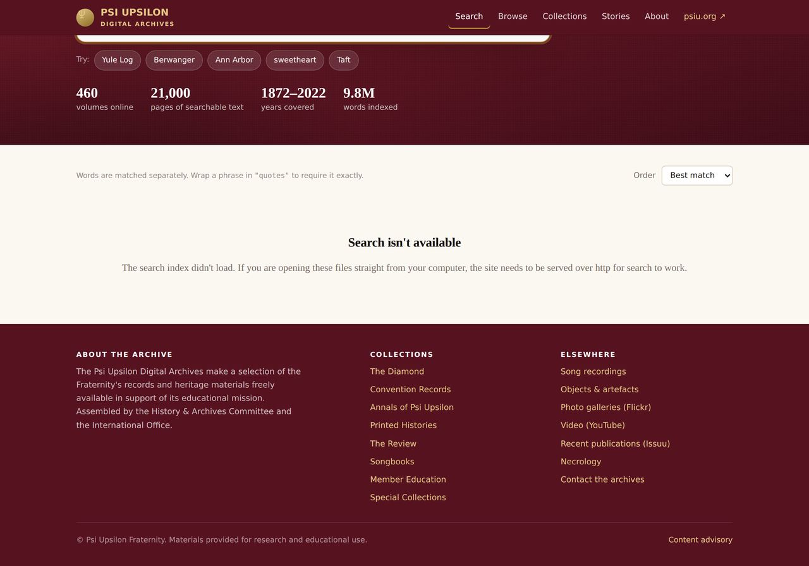
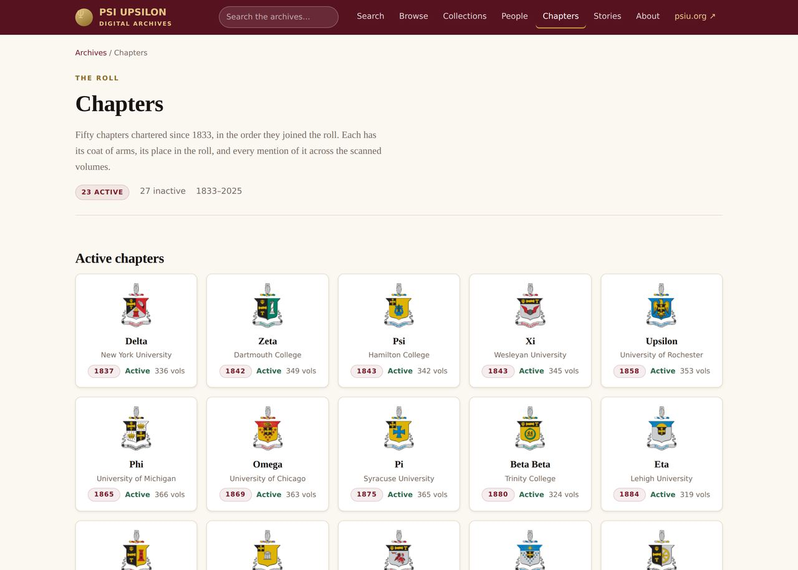

# Psi Upsilon Digital Museum

**Full-text search across 460 scanned volumes of Psi Upsilon publications — 21,332 pages,
1872 to 2022 — plus an interactive timeline of 184 events, a written and sourced biography of
each of the seven founders, 93 notable alumni, all 50 chapters, the songs and the heraldry.**

<!-- Once GitHub Pages is switched on, replace the line below with the real address. -->
Live site: _not published yet — see_ [`GITHUB-SETUP`](#publishing-this-on-github-pages)



A search returns the volume, every page number the words appear on, and the sentence around
each one. Clicking a page opens the scan at that page with the words highlighted. The PDFs
themselves stay on psiu.org; the reader streams only the pages you turn to.



---


A static site (plain HTML, CSS and JavaScript — no WordPress, no database, no
server-side code) that puts **full-text search across every scanned volume** in
the archive, and is built to take audio, video, object records and written
stories as they arrive.

```
site/        ← this is what you deploy. Nothing else needs to go on the server.
data/        ← the archive's metadata + extracted text (the source of truth)
build/       ← the scripts that turn data/ into site/
crawl/       ← raw copies of the current psiu.org pages, used to read the doc list
```

---

## What it does today

- **460 items, 21,300 scanned pages, 1872–2022**, every page's text indexed.
- Search returns the *volume* **and the page numbers** the words appear on;
  clicking a page opens the scan at that page.
- An in-page reader streams the PDF from psiu.org a page at a time, so a 90 MB
  Diamond opens in a second or two instead of downloading in full.
- "Search inside this volume" on every document page.
- Browse by collection or by decade, with real cover images.
- The 14 *From the Archives* articles, pulled across from psiu.org.
- Search results open the scan **at the matching page with the term highlighted on it**, and
  prefill that volume's own search box so every other mention is one click away.
- The two History & Archives Convention presentations (PowerPoint) are indexed too, with
  their slide text searchable alongside the scans.
- An **interactive timeline**, 1833 to today, filterable by category: 107
  hand-written events each cited to a volume and page, plus every chapter's
  chartering and closing. Twelve carry a *not settled* note where the sources
  disagree.
- A **page for each of the seven founders** — a biography of 400 to 600 words
  written out of the archive itself, with birth and death dates and places,
  family where the sources name it, professions and achievements, the volumes
  each life was read from as links into the scans, and every page of the archive
  that names them. Where the founders' own recollections contradict each other
  the page sets the versions side by side rather than choosing: **84 open
  questions** are listed across the seven, each with a note on where a
  researcher could settle it.
- Sections for **song recordings**, **objects & artefacts** and **video** that
  are built and wired up, waiting only for content (see below).

**The PDFs are not copied.** They stay exactly where they are on psiu.org, at
their existing URLs, so nothing breaks and no files move. The new site links to
them and streams them.

---

## Running it locally

```bash
cd psiu-archives
python3 -m http.server 8000 --directory site
# open http://localhost:8000
```

It must be served over http, not opened as a `file://` path — the search index
is fetched over the network like any other asset.

## Deploying

`site/` is a plain folder of files. Any of these work:

| Host | How |
|---|---|
| **Cloudflare Pages / Netlify** (free) | Point it at this repo, build command `bash build/build.sh`, publish directory `site`. Or drag the `site` folder onto the dashboard. |
| **Existing psiu.org server** | Upload the contents of `site/` to e.g. `/archives/` via FTP or cPanel. |
| **GitHub Pages** | Commit `site/` and set Pages to serve it. |

All paths inside the site are relative, so it works at the domain root
(`archives.psiu.org`) or in a subfolder (`psiu.org/archives/`) with no changes.

Once you know the public address, set it before building so canonical links, social-media
previews and a proper `sitemap.xml` get written:

```bash
PSIU_SITE_URL=https://archives.psiu.org ./build/build.sh
```

Everything works without it; you just don't get those three things.

### Publishing this on GitHub Pages

A workflow is already in the repository at `.github/workflows/publish.yml`. It takes the
`site` folder exactly as committed and publishes it — it does not rebuild anything.

1. In the repository on github.com, go to **Settings → Pages**.
2. Under **Build and deployment**, set **Source** to **GitHub Actions**.
3. That is all. The workflow runs on every push to `main`, and on demand from the Actions tab.

The address will be `https://<account>.github.io/<repository>/`. Two things to know:

- **GitHub Pages on a free plan only works from a public repository.** Pages from a private
  repository needs GitHub Pro or Team. If the material must stay unlisted, use Netlify instead
  and password-protect the site there.
- Once you know the address, rebuild once with it set so that canonical links, link previews
  and `sitemap.xml` are correct:
  `PSIU_SITE_URL=https://<account>.github.io/<repository> ./build/build.sh`

Full step-by-step instructions, including installing GitHub Desktop, are in
**Publishing-the-Archive-on-GitHub.docx**.

One server note: the reader streams PDFs from psiu.org cross-origin. That
already works — psiu.org sends `Accept-Ranges: bytes` and
`Access-Control-Allow-Origin: *`. If those headers ever change, the reader falls
back to a plain "open the PDF" link on its own.

---

## Rebuilding

```bash
./build/build.sh            # regenerate pages + search index from data/
./build/build.sh --pull     # re-read psiu.org first, to pick up new PDFs
./build/build.sh --serve    # build, then serve on :8000
```

Requires `python3`, `poppler-utils` (`pdftotext`, `pdftoppm`, `pdfinfo`),
`Pillow`, and `node` (for the one-off `npx pagefind` call).

```bash
# macOS
brew install poppler node && pip3 install pillow
# Debian/Ubuntu
sudo apt install poppler-utils nodejs npm python3-pil
```

### What each script does

| Script | Job |
|---|---|
| `build/crawl_source.py` | Downloads the current psiu.org archive pages into `crawl/`. |
| `build/build_manifest.py` | Parses those pages into `data/items.json` — one record per PDF, with title, collection, year, issue and URL. |
| `build/build_stories.py` | Pulls the *From the Archives* articles and their images. |
| `build/extract.py` | For each PDF: downloads it, extracts per-page text with `pdftotext`, saves a cover thumbnail, **deletes the PDF**. Resumable — skips anything already done. |
| `build/build_timeline.py` | Merges `data/timeline-core.json` with the chapter charterings and closures into `data/timeline.json`. |
| `build/fix_ocr.py` | Repairs the systematic letter confusions in the 2020 text layer (`ll`→`U`, `il`→`k`, `rn`→`m` and friends). Used when reading the scans for research; see the note below. |
| `build/read_pages.py` | Prints any page of any volume with those confusions repaired — `python3 build/read_pages.py <volume-id> 55-60`. This is how the founders' biographies were researched. |
| `build/import_sheets.py` | Reads `data/founders.xlsx` and `data/timeline.xlsx` back into JSON. Runs automatically when a spreadsheet is newer than its JSON. |
| `build/make_sheets.py` | Re-writes those two spreadsheets from the JSON. Only needed if a spreadsheet is lost. |
| `build/gen_site.py` | Writes every page in `site/`, plus the indexer's input in `build/index_html/`. |
| `pagefind` | Builds the chunked search index into `site/pagefind/`. |

`extract.py` is the slow step (it pulls ~18 GB through, once). It never keeps
more than one PDF on disk at a time and can be interrupted and restarted.

---

## Adding things

### More PDFs

1. Upload the PDF to psiu.org as you do now and add it to the relevant
   WordPress archive page.
2. `./build/build.sh --pull`

That's it — the new volume is picked up, its text extracted and its cover made.

If you'd rather not touch WordPress at all, add a record to `data/items.json`
by hand and run `./build/build.sh`:

```json
{
  "id": "1958-history-of-the-epsilon-chapter",
  "type": "document",
  "title": "1958 – History of the Epsilon Chapter",
  "subtitle": null,
  "collection": "histories",
  "year": 1958,
  "seq": 0,
  "pdf": "https://psiu.org/wp-content/uploads/2026/01/1958-Epsilon-History.pdf"
}
```

### Song recordings, video, objects

Create `data/media.json` (copy `data/media.example.json` and edit). Each entry
needs a `type` of `audio`, `video` or `object`:

```json
[
  { "type": "audio",  "id": "…", "title": "…", "audio": "assets/audio/x.mp3",
    "year": 1948, "performer": "…", "description": "…",
    "related": ["songs-of-the-psi-upsilon-fraternity-1945-12th-ed"] },
  { "type": "video",  "id": "…", "title": "…", "youtube": "YOUTUBE_ID", "description": "…" },
  { "type": "object", "id": "…", "title": "…", "images": ["assets/objects/x.jpg"],
    "dimensions": "…", "location": "…", "credit": "…" }
]
```

Put mp3s in `site/assets/audio/` and photographs in `site/assets/objects/`,
then rebuild. Each entry gets its own page, appears on the relevant section
page, and becomes searchable alongside the documents. `related` accepts any
document `id` from `items.json` and draws a cross-link both ways.

### The founders' biographies and the timeline — no code required

These two are edited in **Excel**, not in code. Open the spreadsheet, type in the
yellow cells, save it, and run `./build/build.sh`. The build notices the
spreadsheet is newer than the site and reads it in before rebuilding.

| Spreadsheet | What it controls |
|---|---|
| `data/founders.xlsx` | The seven founders' pages — family, birthplace, where they died and are buried, Find a Grave link, profession, achievements, full biography, portrait, outside links. |
| `data/timeline.xlsx` | The hand-written events on the timeline. Chapter charterings and closings are added automatically and are not in the sheet. |

Rules that matter:

- **Never change the `id` column** (grey). It is what links a founder to their page
  and to every mention of them in the scans.
- **One achievement per line** inside the `achievements` cell (Alt+Enter for a new
  line inside a cell).
- **Links** go in as `Label | https://…`, one per line — e.g.
  `Find a Grave | https://www.findagrave.com/memorial/12345`.
- **Timeline `category`** must be one of: `founding`, `governance`, `publication`,
  `chapter`, `song`, `insignia`, `people`, `convention`.
- Every cell has a comment (the little red corner) explaining what goes in it.

Step-by-step instructions with pictures are in
**Filling-in-the-Founders-and-the-Timeline.docx**.

### Stories

`build_stories.py` reads them from psiu.org automatically. To write one that
never existed on WordPress, append it to `data/stories.json` with `id`, `title`,
`year`, `body` (blank-line-separated paragraphs) and `images`.

---

## Design notes

Colour, type and spacing all come from CSS custom properties at the top of
`site/assets/css/site.css`. Change `--garnet` and `--gold` there and the whole
site follows. Dark mode is handled in the same block and follows the visitor's
system setting.

## Problems found on the current WordPress site

Worth fixing there whether or not this replacement goes live:

1. **The Diamond index links six years to the wrong pages** — 1940→1941, 1941→1924,
   1954→1934, 2009→1939, 2010→1940, 2011→1924. The 1954 page exists and holds four real
   issues, but nothing on the site links to it, so those issues were invisible. This build
   finds them by probing every year directly rather than trusting the index.
2. **The 2023 Gamma Tau presentation link is a `blob:` URL** on the Special Collections
   page. A `blob:` address only exists inside the browser session that created it, so that
   download has never worked for anyone. The file needs re-uploading.
3. **A newer WordPress file-block markup** appears on a couple of pages (1881 and 1884
   Diamond), which a naive parser skips. Two more issues were hiding there.
4. **Genuine gaps**, as far as can be told: Diamond 1879, 1885, 1886, 2009–2011 and 2014;
   Convention Records 1917, 1920 and 1971. Some of these may never have been published —
   worth confirming against the bound volumes.
5. **A few volumes are labelled identically** at the source (two 1878 issues both marked
   Vol. 2 No. 1). The build now numbers them so they can be told apart, but the real
   labels should be corrected.

## Things worth knowing

- **The 2020 text layer has a systematic ligature fault.** Tight ligatures in the
  Fraternity's printing types were read as the wrong letters, consistently:
  `ll`→`U` (*coUege*, *AngeU*), `il`→`k` (*Bakey* for Bailey), `ti`→`k`
  (*beautkul*), `ir`→`k` (*kon* for iron), `rn`→`m` (*Bamard* for Barnard),
  `li`→`h` (*Carohna*), `tl`→`ti` (*Butier* for Butler). Measured: **38,520
  instances** of a short list of confirmed cases across 10.1 million words, and
  the true figure is higher. It matters far more for reading names out of the
  text than for search, because it lands on proper nouns.
  `build/fix_ocr.py` repairs them against a dictionary plus our own name lists
  and, measured against a full fresh OCR of one volume, **recovers 57% of the
  benefit** — it eliminates the `ll`→`U` class entirely — in milliseconds and
  with no downloads. It is used when reading the scans for research; it does not
  yet rewrite `data/text`, so the search index still has the raw text.
- **Re-running the OCR is not worth it for search.** The garbled search
  excerpts on the first build were not an OCR problem. They were a *text
  extraction* problem: `pdftotext -layout` reads a multi-column page — a roster,
  a chapter letter, an In Memoriam list — straight across, interleaving the
  columns into nonsense. `build/extract.py` now extracts every volume both ways
  (`-layout` and `-raw`), scores each against a list of phrases that ought to
  appear in a Psi Upsilon publication, and keeps the better one. That fixed it,
  at no cost. Re-OCRing the whole archive was tested and measured against the
  existing 2020 Kirtas text layer and came out no better; `build/reocr.py`
  exists, documents the measurements, and should be used only on the handful of
  volumes with no text layer at all (`python3 build/reocr.py --find-bad`).
  Note for anyone tempted: `ocrmypdf --redo-ocr` *duplicates* the text layer —
  19% of the words came out doubled. Use `--force-ocr` if you ever must.
- **OCR quality still varies** on foxed paper and tight gutters. Searching a
  surname works better than searching a long phrase. Wrapping a phrase in
  `"quotes"` requires it exactly.
- **Some scans are very large.** A few Diamonds are 60–150 MB, and the College
  Tablet 7th edition is 148 MB. The reader hides this by streaming, but
  "Download the PDF" is still a big download. Re-compressing the worst offenders
  would be a good separate project.
- **The old URLs still work.** Nothing on psiu.org has to be deleted for this
  site to go live; when you're ready, the WordPress archive pages can redirect
  here.
